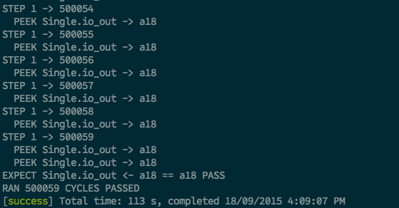

% ELEC3608: Single Cycle Processor Part 2
% Lawrence Wakefield
% 19/09/15

# Introduction

This part of the assignment focuses on the implementing the design proposed in the first part of the assignment. The goal of this implementation is to execute a program `fib.s` which calculates the first 20 Fibonacci. Provided in `Single.scala` is a single test, which tests for the value `0xa18` (`0d2584`), the 18th number in the sequence. This test was ammended to run for 500,000 cycles.

If any of the information below is unclear, please refer to the document provided for the first part. This part is meant as an addition to the first part, not as a standalone document.

The code is available on [GitHub](https://github.com/lwakefield/comp_architecture/blob/master/a2).

# Modifications to Source

## New Opcodes and Function Codes

The following opcodes and function codes were added as follows:

```scala
    val OP_J = UInt(0x02)
    val OP_JAL = UInt(0x03)
    val OP_BEQ = UInt(0x04)
    val OP_BNE = UInt(0x05)
    val FUNC_SLL = UInt(0x00)
    val FUNC_JR = UInt(0x08)
```

The above opcodes and function codes match the values for the MIPS instruction set. As well as the above, a new ALU control signal was added for the `SLL` instruction. The value of the new ALU control signal is arbitrary so long as it is consistent within the processor.

```scala
    val ALU_SLL = UInt(0x08)
```
  
## New Control Signals

New control signals were added to the datapath to accomodate for the new jump and branch instructions. These news signals are as follows:

```scala
    val j_en = Bool(INPUT)
    val j_src = Bool(INPUT)
    val jal = Bool(INPUT)

    val b_en = Bool(INPUT)
    val is_branch_on_eq = Bool(INPUT)
```

The above signals were added as an input to the `Dpath` module from the output of the `Single` module.

## New Control Logic

The following control logic was added to the `Single` module.

### ALU Source Logic

The ALU source logic, was updated to select from registers when using a branch instruction, as follows:

```scala
-   val alu_src = op(C.OP_RTYPE)
+   val alu_src = op(C.OP_RTYPE) || op(C.OP_BNE) || op(C.OP_BEQ)
```

### ALU Operation Logic

The ALU Operation logic was updated to perform a subtraction when using a branch instruction, as well as including the `SLL` instruction, as follows:

```scala
    val alu_op = MuxCase(UInt(0), Array(
        (fop(C.OP_RTYPE, C.FUNC_ADDU) || 
             op(C.OP_ADDI) || op(C.OP_ADDIU) || op(C.OP_SW)
             || op(C.OP_LW)) -> (C.ALU_ADD),
        fop(C.OP_RTYPE, C.FUNC_SUBU) -> (C.ALU_SUB),
        fop(C.OP_RTYPE, C.FUNC_SLTU) -> (C.ALU_SLT),
+       fop(C.OP_RTYPE, C.FUNC_SLL) -> (C.ALU_SLL),
+       (op(C.OP_BNE) || op(C.OP_BNE)) -> (C.ALU_SUB),
        (fop(C.OP_RTYPE, C.FUNC_OR) || op(C.OP_ORI)) -> (C.ALU_OR),
        op(C.OP_LUI) -> (C.ALU_LUIB)))
```

### Jump and Branch Signal Logic

The following signal logic was added to accomodate for jump and branch instructions:

```scala
    val j_en = op(C.OP_J) || op(C.OP_JAL) || fop(C.OP_RTYPE, C.FUNC_JR)
    val j_src = Mux(op(C.OP_RTYPE), UInt(1), UInt(0))
    val jal = op(C.OP_JAL)

    val b_en = op(C.OP_BNE) || op(C.OP_BEQ)
    val is_branch_on_eq = op(C.OP_BEQ)
```

The above signal logic is subsequently passed through to the `Dpath` module.

## New Data Paths

The following modifications were made to the data path in the `Dpath` module.

A new internal signal `addr` now reads the addr from a JType instruction.

```scala
    val addr = inst(25, 0)
```

The `SLL` instruction was added to the ALU.

```scala
    val alu_out = MuxCase(UInt(0), Array(
        aop(C.ALU_ADD) -> (alu_in1 + alu_in2).toUInt,
        aop(C.ALU_SUB) -> (alu_in1 - alu_in2).toUInt,
        aop(C.ALU_LUIB) -> (Cat(alu_in2(15, 0), UInt(0, width=16))).toUInt,
        aop(C.ALU_SLT) -> (Mux(rs < rt, UInt(1), UInt(0))).toUInt,
~       aop(C.ALU_OR) -> (alu_in1 | alu_in2).toUInt,
+       aop(C.ALU_SLL) -> (alu_in1 << shamt).toUInt))
```

Internal signals were added for jumping and branching.

```scala
    val j_addr = Mux(io.j_src, rs, UInt(4) * addr)

    val branch = io.b_en &&
        ((~io.is_branch_on_eq && ~io.zero) ||
        (io.is_branch_on_eq && ~io.zero))
    val branch_addr = Mux(branch, pc + (UInt(4) * sextimm), pcp4)
```

There is internal logic based upon the above signals, to decide the next PC address

```scala
    when (io.jal) {
        regfile(UInt(31)) := pcp4
    }
    when (io.j_en) {
        pc := j_addr
    }.elsewhen (io.b_en) {
        pc := branch_addr
    }.otherwise {
        pc := pcp4
    }
```

# Output

With the following changes made above, the Single Cycle processor executes the fib.s program correctly. A full display of the internal signals and register values may prove to be overwhelming, instead provided below is a screenshot of the final lines of output from the test bench.


