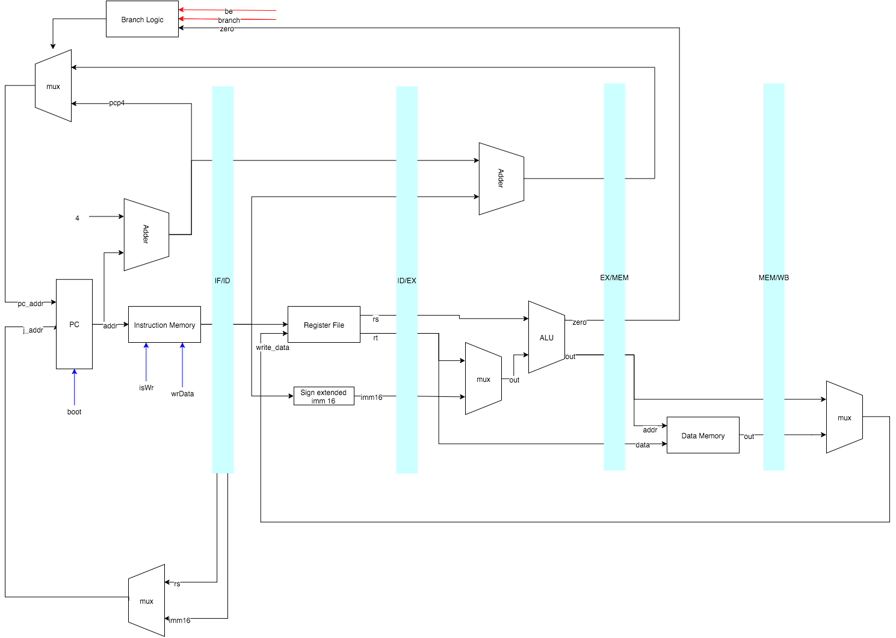

% ELEC3608: Single Cycle Processor Part 3
% Lawrence Wakefield
% 10/10/15

# Introduction

A single cycle processor requires a large amount of logic to be performed per each clock cycle. All logic must be complete in a singly cycle (by definition), as a result the critical path of the processor design is larger than its pipelined counterpart. A pipelined processor breaks the execution of an instruction into several stages, this allowing a shorter clock cycle. The trade off is that a single instruction now takes multiple cycles to fully execute, although this is not a large issue as multiple instructions can be in the pipeline at any one time.

Since a pipelined processor may have multiple instructions in the pipeline at any one time an issue arises when the processor tries to execute instructions that are dependent on one another. An example is shown below.

```
add $t1, $t2, $t3       # $t1 = $t2 + $t3 
add $t4, $t1, $t2       # $t4 = $t1 + $t2
```

The second instruction now requires that register ``$t1`` must be updated by the first instruction before the second instruction reads from ``$t1``. In the case of a pipelined processor, both instructions may be in the pipeline at the same time. If this is the case then the second instruction may not execute correctly, this is known as a _hazard_. To avoid a hazard, the simplest solution is to wait until the first instruction has finished executing. _Hazards_ may also be dynamically detected and resolved by forwarding, which will be discussed in the next part of the assignment.

This part of the assignment focuses on improving the single cycle processor (built in the last part of the assignment), by employing a five stage pipeline. As a test bench we will modify the Fibonacci program provided by inserting ``nop`` instructions to resolve hazards.

The code is available on [GitHub](https://github.com/lwakefield/comp_architecture/blob/master/a3).

# Datapath

To employ a five stage pipelined processor, let us first define the five stages.

- Instruction Fetch (IF): Instruction is fetched from the instruction memory
- Instruction Decode (ID): Instruction is decoded
- Execution (EX): Execution of the instruction
- Memory Write (MEM): Writing of any results to the Data Memory (if required)
- Register Write Back (WB): Writing of any results back to the Register file (if required)

To hold the results of each stage, we will require four blocks of registers between of the five stages: IF/ID, ID/EX, EX/MEM and MEM/WB. These registers will be updated on each clock cycle with the results of each stage and provide the results to the next stage on the next cycle.

The control signals are set on a per-stage basis, for example the ALU operation code is set in the EX stage.

Below is a diagram of the new data path of the pipelined processor. For readability sake, most control signals have been omitted.



# Results of the new Datapath

As a result of the new datapath, different instructions may finish executing in a different number of clock cycles. These changes are noted below.

## Arithmetic Instructions

Arithmetic instructions will take a full five clock cycles to execute. This is a result of the Write Back stage being the final stage in the pipeline. This is irrelevant of whether the instruction is an R type or an I type, as in both cases, the result must be written back to a register. 

As a result, if two consecutive arithmetic instructions contain a hazard, then a total of three ``nop`` instructions must be inserted to resolve the hazard. This is an important note as it is the most common hazard we are required to resolve for the Fibonacci program.

## Memory load/store Instructions

A load instruction now takes a full five cycles to complete as the result must be written back to a register. Whilst a store instruction only takes four cycles as it does not need to write a result back to memory.

Similar to the arithmetic instructions, if a ``load`` instruction has a hazard in a following arithmetic or ``load`` / ``store`` instruction, then we must resolve this with a total of three ``nop`` instructions.

## Jump Instructions

Jump instructions take two clock cycles to complete. As jump instructions are not conditional (they will always make a jump), the address of the jump instruction will be loaded into program counter during the ID stage.

As a jump is not conditional, we always insert a ``nop`` instruction after a jump instruction. This is because we do not want the next instruction to enter the pipeline before the program counter is updated. For example, given the sequence of instructions below, a jump instruction takes two cycles to complete, the add instruction will enter the pipeline (which we do not want). To solve this a ``nop`` instruction should be added between the instructions. This is referred to as a _control hazard_.

```
j FOO_FUNCTION
add $t1, $t2, $t3
```

## Branch Instructions

Branch instructions require a total of four cycles to complete, this is due to the execution stage in which a comparison is made between two values in order to determine whether a branch will be made. 

Similar to jump instructions, we must wait until a branch instruction has finished executing before any more instructions may enter the pipeline. A total of three ``nop`` instructions must be inserted to avoid any other instructions entering the pipeline.

# Restructuring of the Project

Due to the increasing complexity of the processor, the project was split up into a number of different files. Most notably, ``Single.scala`` now only contains tests which make up our test suite. The tests include:

- SimplePipelineTest: Check that a basic pipelined operation works
- BrokenHazardTest: Check that the processor fails when there is a hazard that is not resolved
- HandlesHazardTest: Check that the processor handles a hazard correctly, if resolved in software
- JumpTest: Check the processor jumps correctly
- BranchTest: Check the processor branches correctly
- FibTest: Check the processor executes the modified Fibonacci program. Note the number of steps is reduced for convenience.

``Datapath.scala`` now contains all control logic and registers, whilst ``Constants.scala`` (aptly) contains all constants.

# Modifying Fibonacci program

As noted in the above section, a number of modifications to the Fibonacci program must be made for the program to work with our newly pipelined processor. As a result, the program now requires many more clock cycles to complete execution.

# Output

With the changes to the datapath made, the Single Cycle processor is still able execute the fib.s program correctly (albeit in more clock cycles than previously). A full display of the internal signals and register values may prove to be overwhelming, however it is recommended that you run the following command to observe the project passing all tests.

```bash
make Core.out
```

# Improvements

## Performance

The most obvious improvements will be addressed in the next part of this assignment. These improvements will include dynamic detection of hazards and forwarding of data.

## Code

There is a significant amount of refactoring that is possible in the code to improve readability.

- Remove ``core.scala``, move logic from ``datapath.scala`` into ``core.scala``, or split the logic between the two files. Currently ``core.scala`` is just a wrapper around the datapath.
- Remove any unused signals/registers. Luckily chisel removes any unused signals/registers on compilation, however that is no excuse for sloppy code.